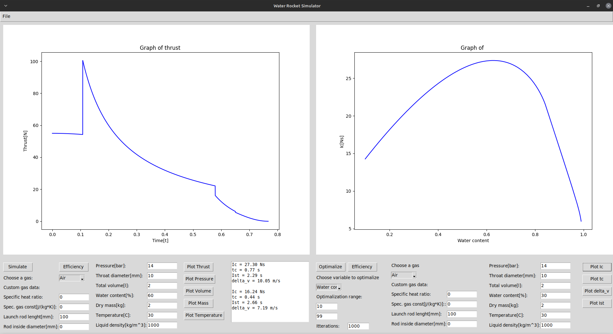

# Water rocket simulator

## Application Purpose and Capabilities 
This application simulates simple rocket engine, consisting of chamber with pressurized gas and liquid. Rocket thrust is generated through expulsion of either liquid or gas, caused by the expansion of gas. Users have the flexibility to select from a list of predefined gases or introduce custom ones.

The simulation consists of three stages:

1. **Start from the launch rod** 
2. **Liquid expulsion**
3. **Gas expulsion**
Beside simulation for single set of data, this program allows you to view plots of output parameters vs values of certain input paramenter. Thanks to that, it allows for efficient motor desing and helps with understanding physical model behind it.  

Beyond individual simulations, the program offers a feature allowing users to visualize plots depicting output values against varying input parameters. This functionality not only supports the efficient design of rocket motors but also aids in understanding the physical model behind the simulation.

Here's a picture that shows how the program works:



## Features

1. **Easy-to-Use Interface:**
   Enjoy a super extra cool graphical setup that makes everything clear and easy to understand.

2. **Project Export Option:**
   Save your projects in a `.eng` file format that allows you to import your engine to Open Rocket projects.

3. **Total Control Over Variables:**
   Tweak all the important engine settings just the way you want, so you get the results you're looking for.

4. **Customizable Gases and Liquids:**
   Use your own custom gases and liquids to fit your setup or choose gas from list.

5. **Optimization Made Simple:**
   Play around with an optimization system that visually shows you the best values for different variables. Optimalization system shows you plots of important values depending on input variable in range of your choosing. 

6. **Save and Load Projects:**
   Keep your work organized by easily saving and loading your projects.

These features all come together to make a simulator for a compressed gas and liquid engine. It helps you figure out and control engine values in efficient and visually informative way.

## Prerequisites

Before running the `simulator.py`, make sure you have the following prerequisites installed:

1. **Python**: The application requires Python. You can download the latest version of Python from [python.org](https://www.python.org/downloads/), Windows store or using terminal. 

2. **Matplotlib**: This library is used for plotting and visualizing data. You can install it using the following command:

   ```bash
   pip install matplotlib
   ```

3. **Tkinter**: Tkinter is Python's standard GUI (Graphical User Interface) package. It is included with most Python installations, so you usually don't need to install it separately. However, if you encounter issues, ensure that Tkinter is installed.

## Running the Application

### Windows PowerShell

1. **Download Python**:
   - Open your web browser and go to [python.org](https://www.python.org/downloads/).
   - Download the latest version of Python for Windows.
   - During installation, make sure to check the box that says "Add Python to PATH."

   - Or install it using Windows Store

2. **Install Required Packages**:
   Open PowerShell and run the following commands to install the required packages:

   ```powershell
   pip install matplotlib
   ```

3. **Run the Application**:
   Navigate to the directory containing `simulator.py` and run the following command:

   ```powershell
   python simulator.py
   ```

### Linux Ubuntu

1. **Install Python**:
   - Open the terminal.
   - Run the following commands to install Python:

     ```bash
     sudo apt update
     sudo apt install python3
     ```

2. **Install Required Packages**:
   Open the terminal and run the following commands:

   ```bash
   sudo apt install python3-pip
   pip3 install matplotlib
   ```

3. **Run the Application**:
   Navigate to the directory containing `simulator.py` in the terminal and run the following command:

   ```bash
   python3 simulator.py
   ```

---

In case of problems with instalation and opening `simulator.py` just use google or chat GPT. Instalation and opening should be relatively simple on both Windows or Linux.


## To do:

1. Find bugs